# MVVM Expliqué avec des Diagrammes

> **Guide ultra-visuel pour comprendre MVVM en Flutter**

---

##  Table des matières

1. [MVVM en 3 images simples](#1-mvvm-en-3-images-simples)
2. [L'architecture dans notre code](#2-larchitecture-dans-notre-code)
3. [Le flux de données complet](#3-le-flux-de-données-complet)
4. [Exemple concret : Charger des articles](#4-exemple-concret--charger-des-articles)
5. [Qui appelle qui ?](#5-qui-appelle-qui-)
6. [Où est quoi dans le code ?](#6-où-est-quoi-dans-le-code-)
7. [Les 3 règles d'or](#7-les-3-règles-dor)

---

## 1. MVVM en 3 images simples

###  Vue d'ensemble

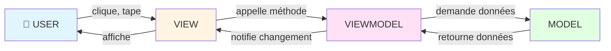

###  Le cycle complet

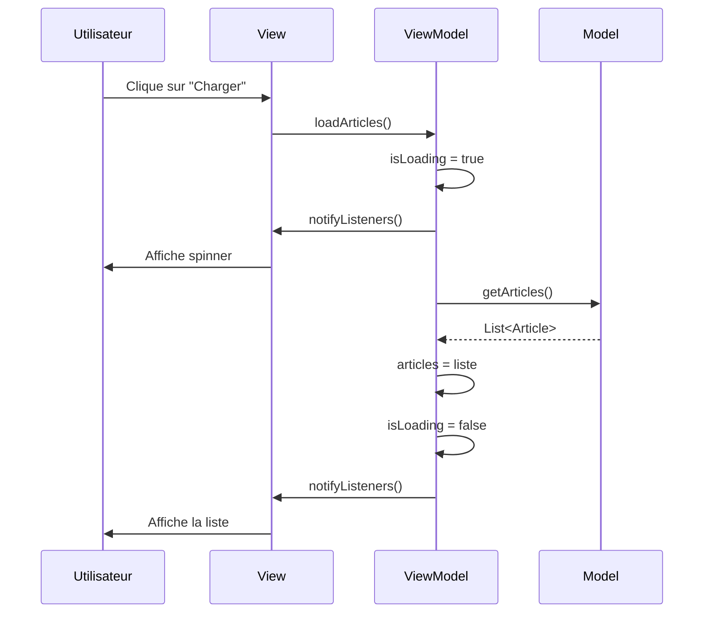

###  Architecture en couches

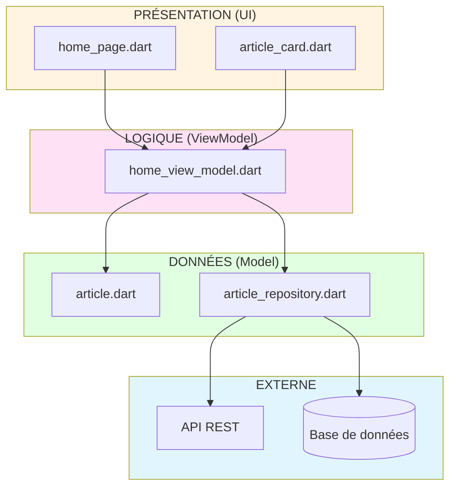

---

## 2. L'architecture dans notre code

###  Structure des fichiers

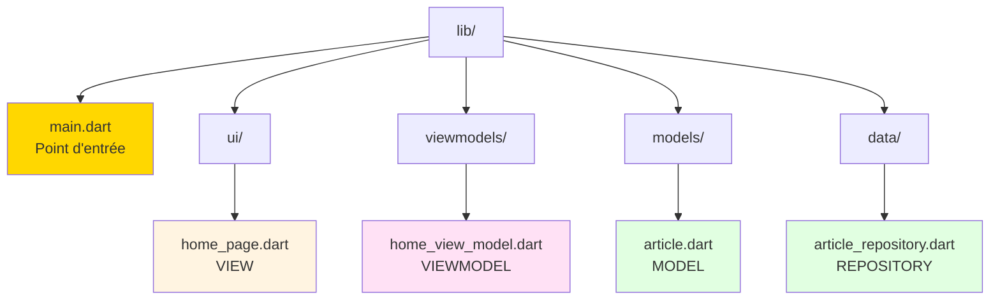

###  Responsabilités de chaque fichier

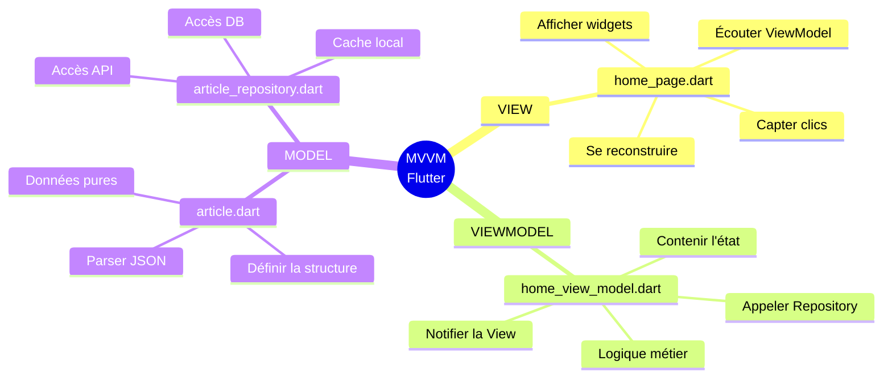

---

## 3. Le flux de données complet

###  Flux bidirectionnel

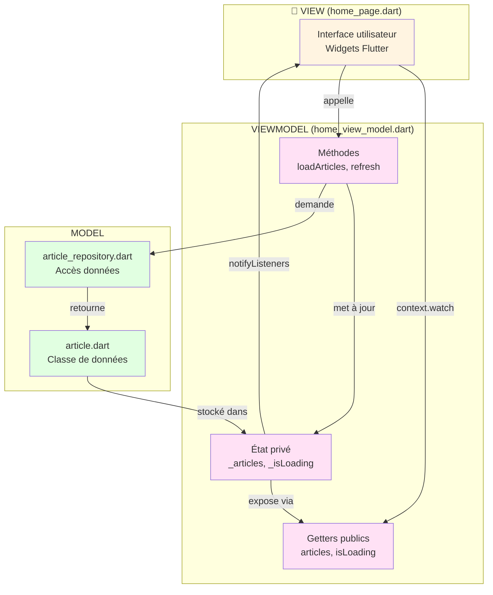

### 📊 Communication entre couches

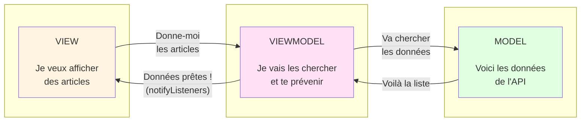

---

## 4. Exemple concret : Charger des articles

###  Scénario étape par étape

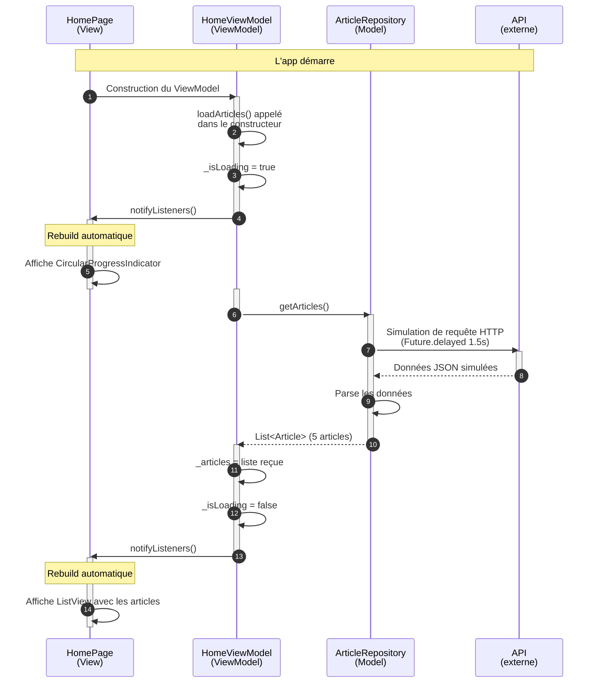

###  Code correspondant à chaque étape

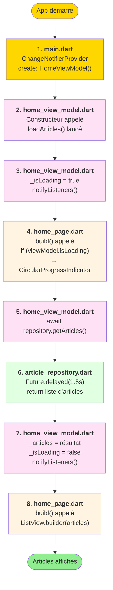

---

## 5. Qui appelle qui ?

###  Diagramme d'appels de méthodes

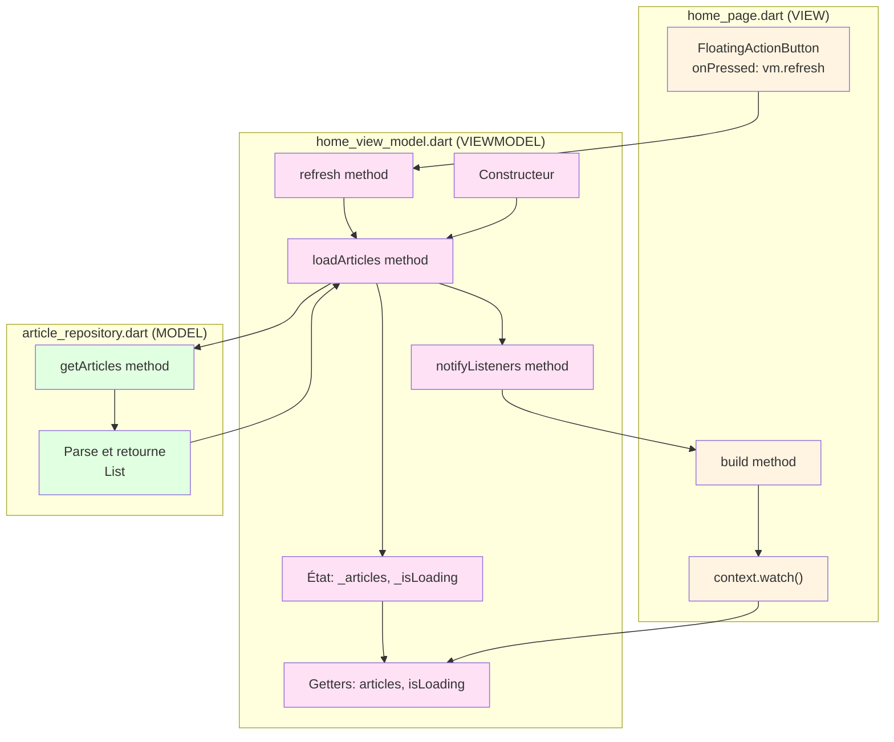

### 🔗 Dépendances entre fichiers

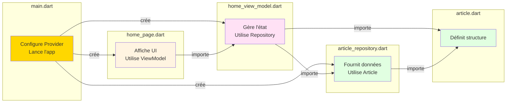

---

## 6. Où est quoi dans le code ?

###  Cartographie complète

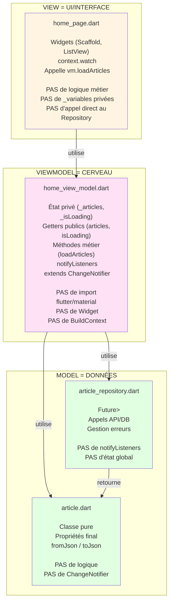

###  Contenu de chaque fichier (simplifié)

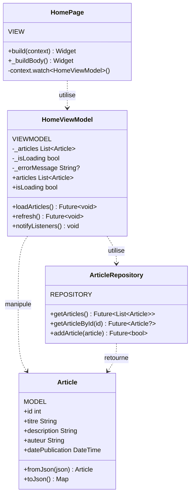

---

## 7. Les 3 règles d'or

###  Règle 1 : La View est BÊTE

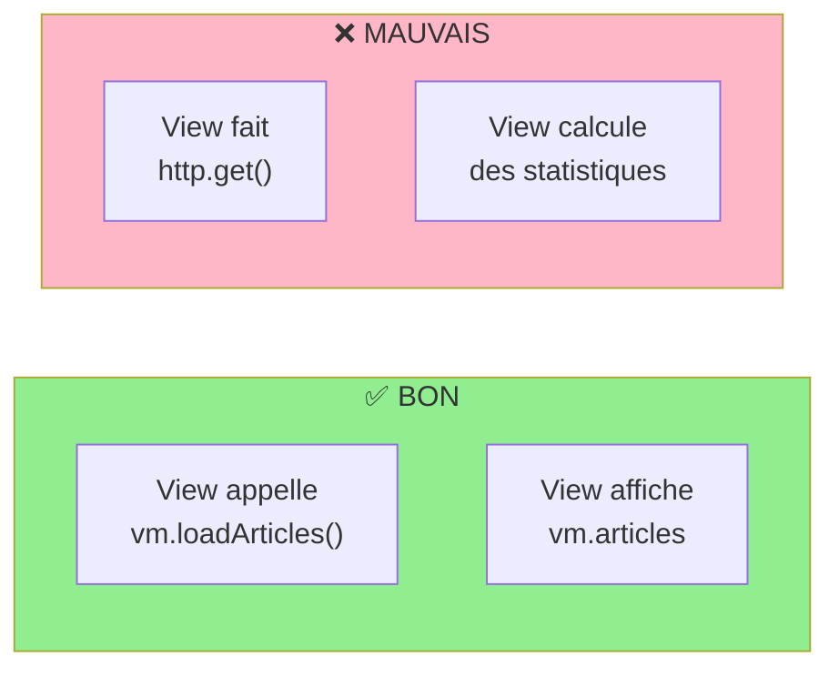

**En code :**

```dart
// ✅ BON
class HomePage extends StatelessWidget {
  @override
  Widget build(BuildContext context) {
    final vm = context.watch<HomeViewModel>();
    
    if (vm.isLoading) return CircularProgressIndicator();
    return ListView.builder(itemCount: vm.articles.length, ...);
  }
}

// ❌ MAUVAIS
class HomePage extends StatelessWidget {
  @override
  Widget build(BuildContext context) {
    final articles = http.get('api.com/articles'); // ❌ Logique dans la View !
    final count = articles.where((a) => a.likes > 10).length; // ❌ Calcul dans la View !
    return ListView(...);
  }
}
```

---

###  Règle 2 : Le ViewModel ne connaît PAS Flutter

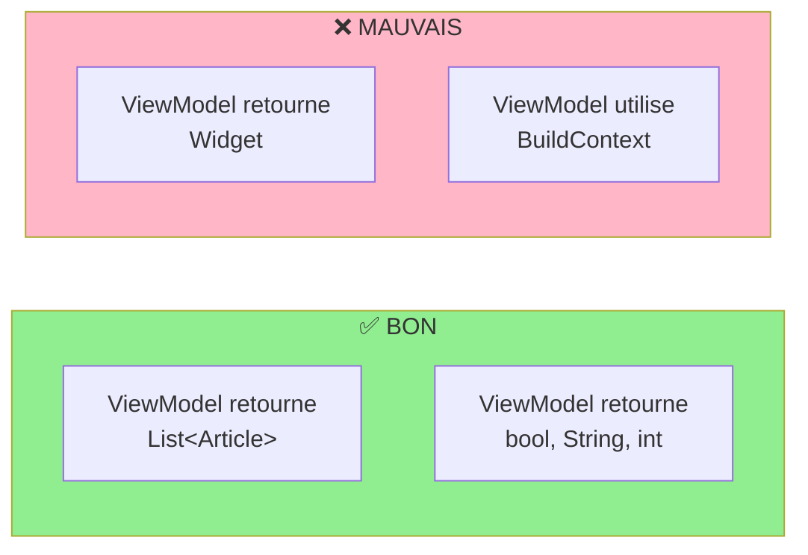

**En code :**

```dart
// ✅ BON
class HomeViewModel extends ChangeNotifier {
  List<Article> get articles => _articles;
  bool get isLoading => _isLoading;
  
  Future<void> loadArticles() async { ... }
}

// ❌ MAUVAIS
class HomeViewModel extends ChangeNotifier {
  Widget buildArticleCard(BuildContext context) { // ❌ Widget dans ViewModel !
    return Card(...);
  }
  
  void showDialog(BuildContext context) { // ❌ BuildContext dans ViewModel !
    showDialog(...);
  }
}
```

---

###  Règle 3 : Le flux est UNIDIRECTIONNEL

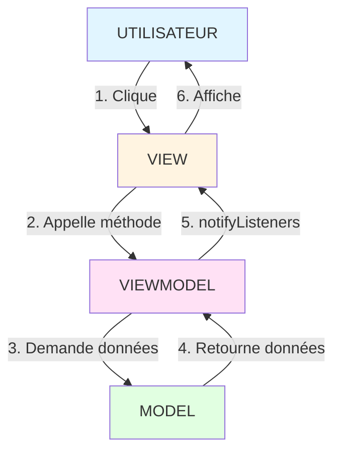

**Interdits :**
- ❌ View → Model directement (sauter le ViewModel)
- ❌ Model → View directement (le Model ne connaît pas la View)
- ❌ Model → ViewModel (pas de notifyListeners dans le Model)

---

## 8. Comparaison : Avec et sans MVVM

### 🔴 SANS MVVM (tout mélangé)

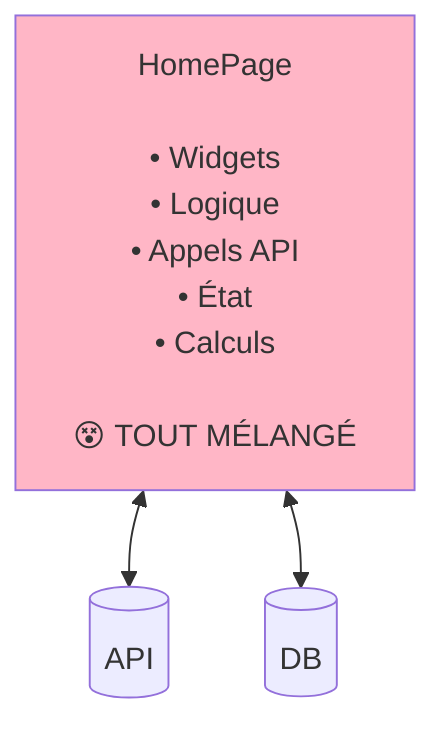

**Problèmes :**
- ❌ Difficile à tester
- ❌ Difficile à maintenir
- ❌ Impossible de réutiliser la logique
- ❌ Code "spaghetti"

---

###  AVEC MVVM (séparé)

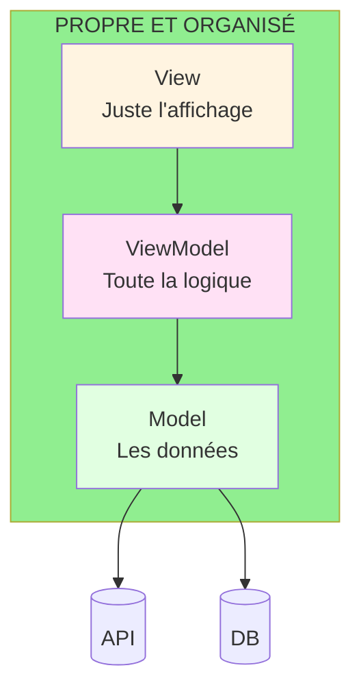

**Avantages :**
-  Facile à tester (chaque couche séparément)
-  Facile à maintenir (responsabilités claires)
-  Réutilisable (même ViewModel pour mobile/web/desktop)
-  Code propre et lisible

---

## 9. Récapitulatif visuel final

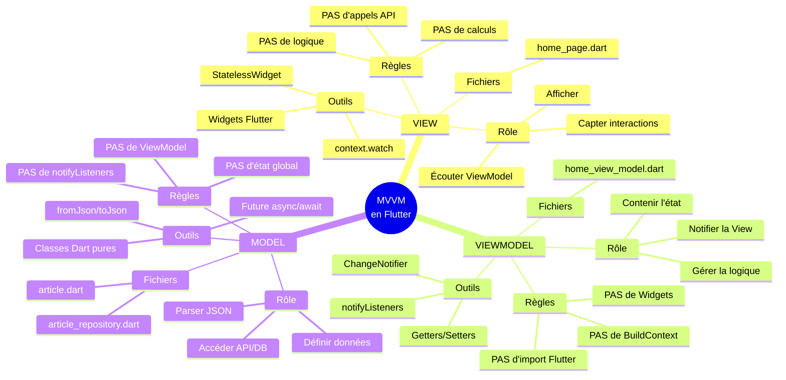

---

## 10. Aide-mémoire (Cheat Sheet)

|  Question |  View |  ViewModel |  Model |
|------------|---------|--------------|----------|
| **Où mettre les widgets ?** | ✅ Oui | ❌ Non | ❌ Non |
| **Où mettre l'état ?** | ❌ Non | ✅ Oui (_variables) | ❌ Non |
| **Où mettre la logique ?** | ❌ Non | ✅ Oui (méthodes) | ❌ Non |
| **Où appeler l'API ?** | ❌ Non | ❌ Non | ✅ Oui (Repository) |
| **Où parser le JSON ?** | ❌ Non | ❌ Non | ✅ Oui (fromJson) |
| **Où utiliser notifyListeners ?** | ❌ Non | ✅ Oui | ❌ Non |
| **Où utiliser context.watch ?** | ✅ Oui | ❌ Non | ❌ Non |
| **Testable sans Flutter ?** | ❌ Non | ✅ Oui | ✅ Oui |

---

##  Conclusion

MVVM, c'est comme une équipe :

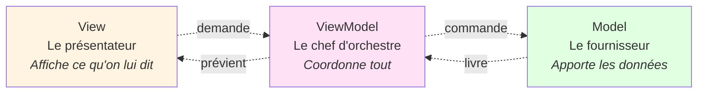

**Chacun son job, tout est clair !** 

---

##  Pour aller plus loin

-  [README.md](README.md) - Vue d'ensemble du projet
-  [01-ARCHITECTURE.md](01-ARCHITECTURE.md) - Guide détaillé
-  [02-EXAMPLES.md](02-EXAMPLES.md) - Exemples pratiques
-  [QUICKSTART.md](QUICKSTART.md) - Démarrage rapide

---

**Créé avec  pour apprendre MVVM en Flutter**

