# Quiz Visuel MVVM - Devinez l'erreur !

> **Quiz avec diagrammes : Est-ce du MVVM ? Trouvez l'erreur !**

---

## Instructions

- Analysez chaque diagramme
- Répondez : MVVM ou PAS MVVM ?
- Si pas MVVM, trouvez l'erreur
- Les réponses sont après chaque question

---

## Question 1 : Architecture simple

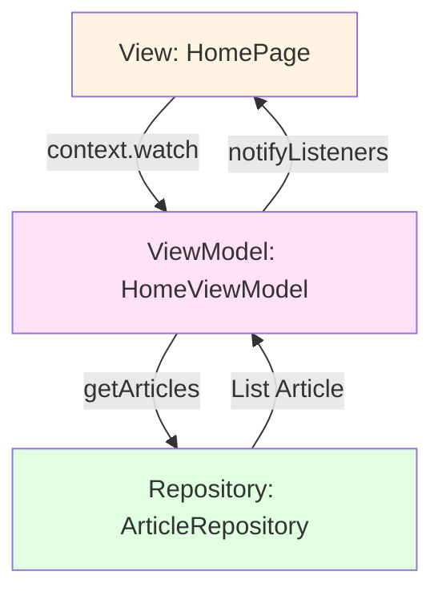
```mermaid
graph TD
    View[View: HomePage]
    VM[ViewModel: HomeViewModel]
    Repo[Repository: ArticleRepository]
    
    View -->|context.watch| VM
    VM -->|getArticles| Repo
    Repo -->|List Article| VM
    VM -->|notifyListeners| View
    
    style View fill:#fff4e1
    style VM fill:#ffe1f5
    style Repo fill:#e1ffe1
```

**Est-ce du MVVM ?**

<details>
<summary>Voir la réponse</summary>

**OUI, c'est du MVVM !**

**Raison :**
- Flux unidirectionnel clair
- View écoute le ViewModel
- ViewModel appelle le Repository
- Séparation correcte des couches

</details>

---

## Question 2 : Communication directe

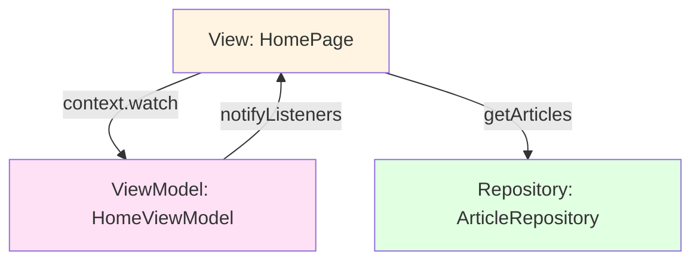
```mermaid
graph TD
    View[View: HomePage]
    VM[ViewModel: HomeViewModel]
    Repo[Repository: ArticleRepository]
    
    View -->|context.watch| VM
    View -->|getArticles| Repo
    VM -->|notifyListeners| View
    
    style View fill:#fff4e1
    style VM fill:#ffe1f5
    style Repo fill:#e1ffe1
```

**Est-ce du MVVM ?**

<details>
<summary>Voir la réponse</summary>

**NON, ce n'est PAS du MVVM !**

**Erreur :** La View appelle directement le Repository (View → Repository)

**Problème :**
- Saute la couche ViewModel
- Pas de séparation des responsabilités
- La logique est dans la View

**Solution :**
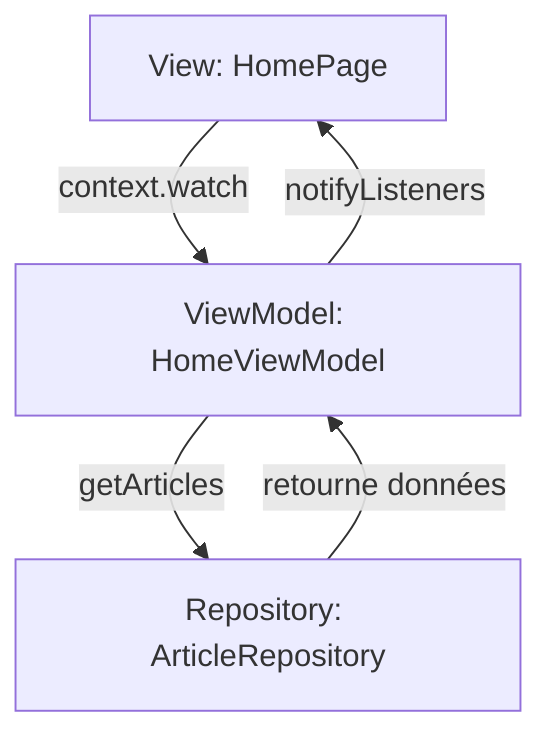
```mermaid
graph TD
    View[View: HomePage]
    VM[ViewModel: HomeViewModel]
    Repo[Repository: ArticleRepository]
    
    View -->|context.watch| VM
    VM -->|getArticles| Repo
    Repo -->|retourne données| VM
    VM -->|notifyListeners| View
```

</details>

---

## Question 3 : ViewModel qui retourne des Widgets

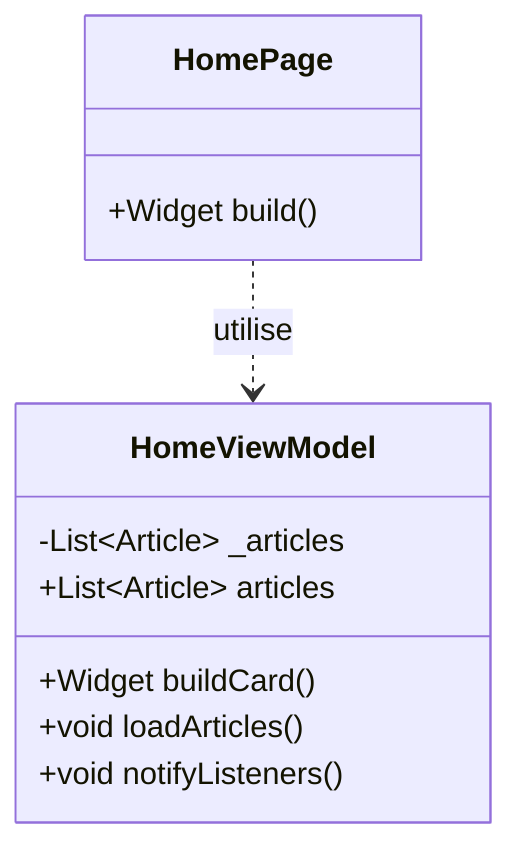
```mermaid
classDiagram
    class HomeViewModel {
        -List~Article~ _articles
        +List~Article~ articles
        +Widget buildCard()
        +void loadArticles()
        +void notifyListeners()
    }
    
    class HomePage {
        +Widget build()
    }
    
    HomePage ..> HomeViewModel : utilise
```

**Est-ce du MVVM ?**

<details>
<summary>Voir la réponse</summary>

**NON, ce n'est PAS du MVVM !**

**Erreur :** Le ViewModel a une méthode `buildCard()` qui retourne un `Widget`

**Problème :**
- Le ViewModel ne doit PAS retourner de Widgets
- Le ViewModel ne doit PAS connaître Flutter
- Mélange des responsabilités

**Solution :**
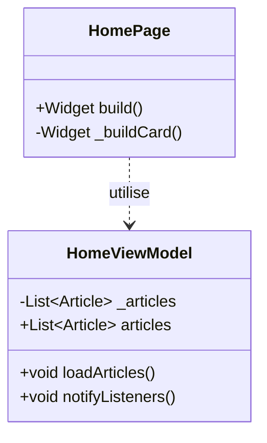
```mermaid
classDiagram
    class HomeViewModel {
        -List~Article~ _articles
        +List~Article~ articles
        +void loadArticles()
        +void notifyListeners()
    }
    
    class HomePage {
        +Widget build()
        -Widget _buildCard()
    }
    
    HomePage ..> HomeViewModel : utilise
```

</details>

---

## Question 4 : Model avec état observable

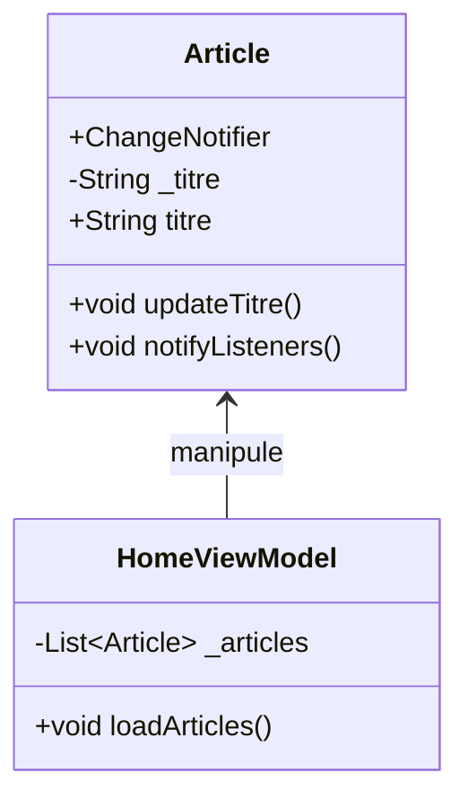
```mermaid
classDiagram
    class Article {
        +ChangeNotifier
        -String _titre
        +String titre
        +void updateTitre()
        +void notifyListeners()
    }
    
    class HomeViewModel {
        -List~Article~ _articles
        +void loadArticles()
    }
    
    Article <-- HomeViewModel : manipule
```

**Est-ce du MVVM ?**

<details>
<summary>Voir la réponse</summary>

**NON, ce n'est PAS du MVVM !**

**Erreur :** Le Model (Article) hérite de `ChangeNotifier` et appelle `notifyListeners()`

**Problème :**
- Le Model doit être une classe pure de données
- Seul le ViewModel doit gérer les notifications
- Confusion des responsabilités

**Solution :**
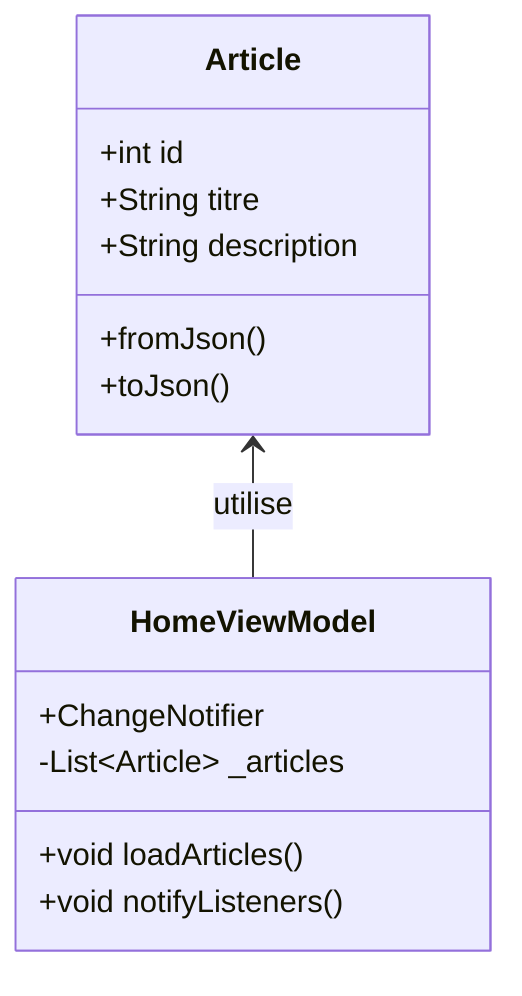
```mermaid
classDiagram
    class Article {
        +int id
        +String titre
        +String description
        +fromJson()
        +toJson()
    }
    
    class HomeViewModel {
        +ChangeNotifier
        -List~Article~ _articles
        +void loadArticles()
        +void notifyListeners()
    }
    
    Article <-- HomeViewModel : utilise
```

</details>

---

## Question 5 : Flux bidirectionnel

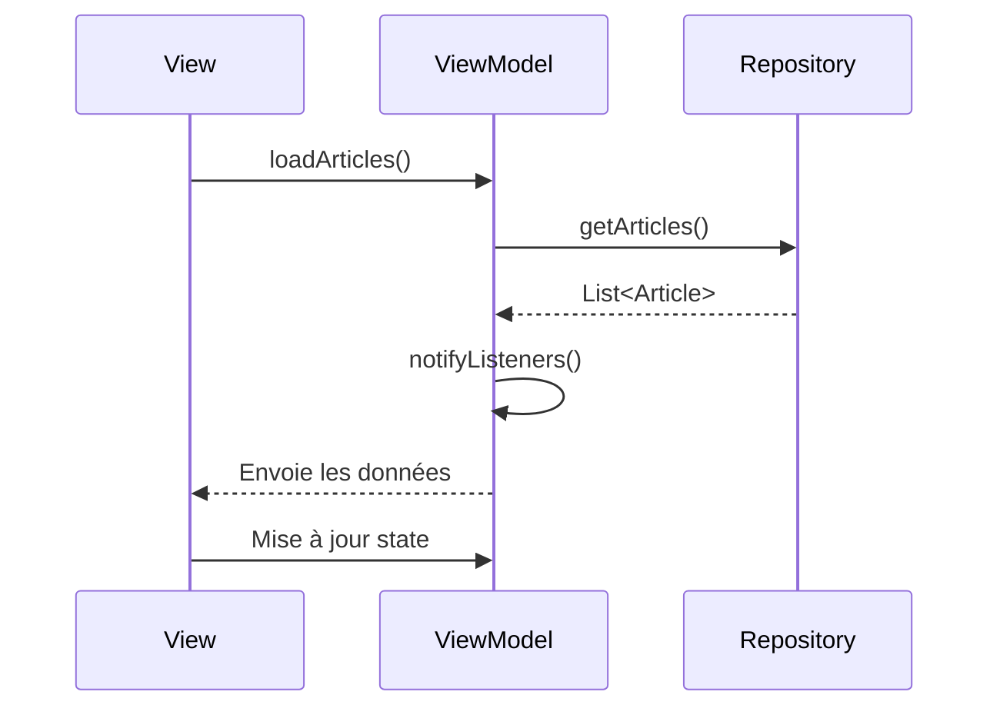
```mermaid
sequenceDiagram
    participant View
    participant ViewModel
    participant Repository
    
    View->>ViewModel: loadArticles()
    ViewModel->>Repository: getArticles()
    Repository-->>ViewModel: List<Article>
    ViewModel->>ViewModel: notifyListeners()
    ViewModel-->>View: Envoie les données
    View->>ViewModel: Mise à jour state
```

**Est-ce du MVVM ?**

<details>
<summary>Voir la réponse</summary>

**NON, ce n'est PAS du MVVM !**

**Erreur :** La dernière flèche "View → ViewModel: Mise à jour state"

**Problème :**
- La View ne doit PAS mettre à jour l'état du ViewModel
- Flux bidirectionnel incorrect
- La View doit seulement appeler des méthodes, pas modifier l'état

**Solution :**
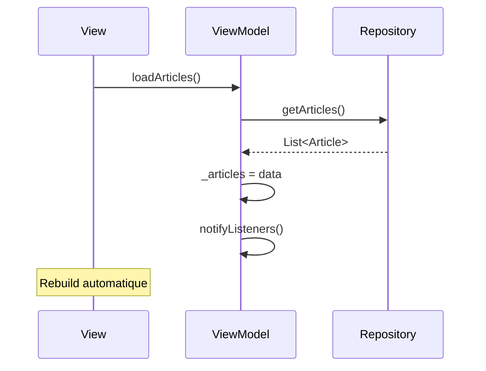
```mermaid
sequenceDiagram
    participant View
    participant ViewModel
    participant Repository
    
    View->>ViewModel: loadArticles()
    ViewModel->>Repository: getArticles()
    Repository-->>ViewModel: List<Article>
    ViewModel->>ViewModel: _articles = data
    ViewModel->>ViewModel: notifyListeners()
    Note over View: Rebuild automatique
```

</details>

---

## Question 6 : Repository avec état

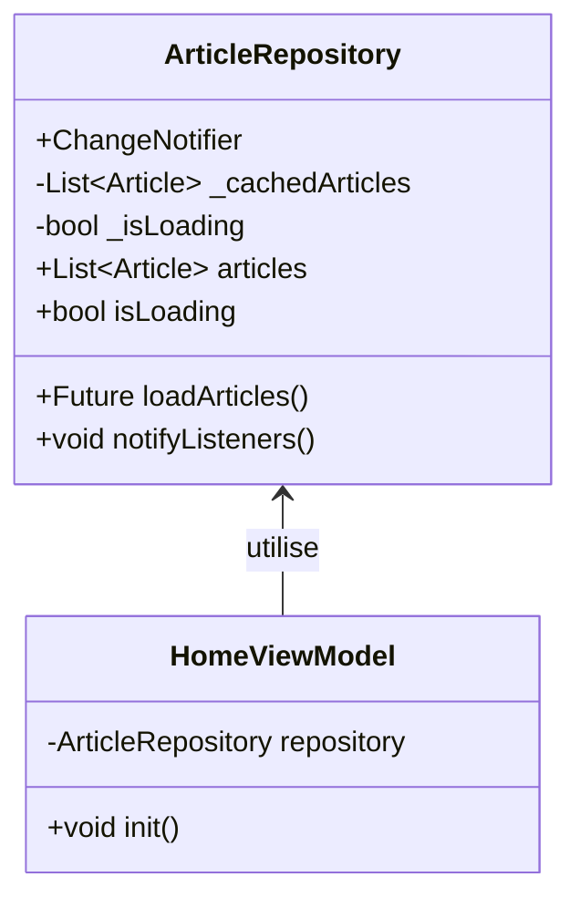
```mermaid
classDiagram
    class ArticleRepository {
        +ChangeNotifier
        -List~Article~ _cachedArticles
        -bool _isLoading
        +List~Article~ articles
        +bool isLoading
        +Future loadArticles()
        +void notifyListeners()
    }
    
    class HomeViewModel {
        -ArticleRepository repository
        +void init()
    }
    
    ArticleRepository <-- HomeViewModel : utilise
```

**Est-ce du MVVM ?**

<details>
<summary>Voir la réponse</summary>

**NON, ce n'est PAS du MVVM !**

**Erreur :** Le Repository hérite de `ChangeNotifier` et gère l'état (`_isLoading`, `_cachedArticles`)

**Problème :**
- Le Repository doit juste fournir des données
- La gestion d'état est la responsabilité du ViewModel
- Le Repository ne doit PAS appeler `notifyListeners()`

**Solution :**
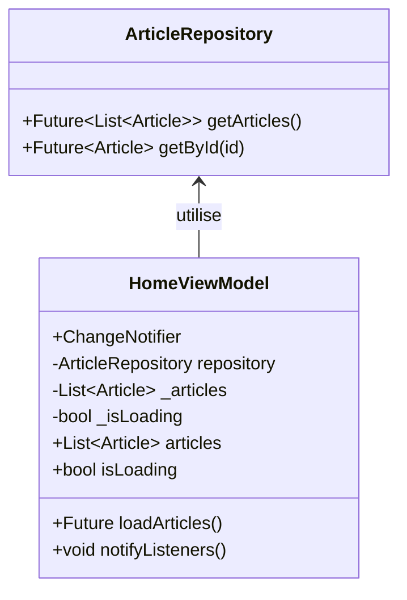
```mermaid
classDiagram
    class ArticleRepository {
        +Future~List~Article~~ getArticles()
        +Future~Article~ getById(id)
    }
    
    class HomeViewModel {
        +ChangeNotifier
        -ArticleRepository repository
        -List~Article~ _articles
        -bool _isLoading
        +List~Article~ articles
        +bool isLoading
        +Future loadArticles()
        +void notifyListeners()
    }
    
    ArticleRepository <-- HomeViewModel : utilise
```

</details>

---

## Question 7 : ViewModel qui connaît la View

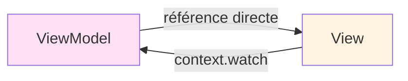
```mermaid
graph LR
    VM[ViewModel]
    View[View]
    
    VM -->|référence directe| View
    View -->|context.watch| VM
    
    style VM fill:#ffe1f5
    style View fill:#fff4e1
```

**Est-ce du MVVM ?**

<details>
<summary>Voir la réponse</summary>

**NON, ce n'est PAS du MVVM !**

**Erreur :** Le ViewModel a une référence directe vers la View

**Problème :**
- Le ViewModel ne doit PAS connaître la View
- Couplage fort entre ViewModel et View
- Impossible de tester le ViewModel seul
- Impossible de réutiliser le ViewModel

**Solution :**
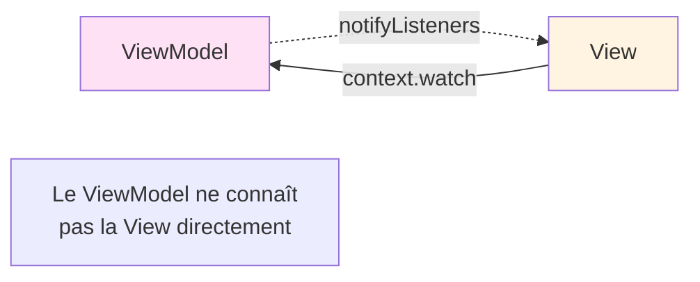
```mermaid
graph LR
    VM[ViewModel]
    View[View]
    
    View -->|context.watch| VM
    VM -.->|notifyListeners| View
    
    Note[Le ViewModel ne connaît<br/>pas la View directement]
    
    style VM fill:#ffe1f5
    style View fill:#fff4e1
```

</details>

---

## Question 8 : Architecture complète

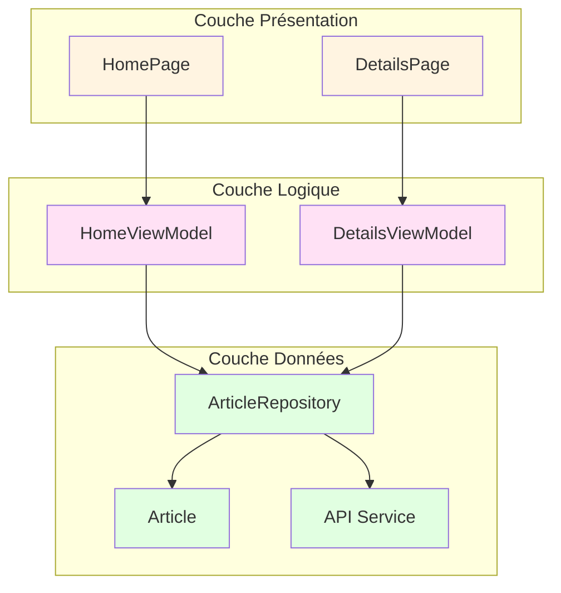
```mermaid
graph TB
    subgraph "Couche Présentation"
        View1[HomePage]
        View2[DetailsPage]
    end
    
    subgraph "Couche Logique"
        VM1[HomeViewModel]
        VM2[DetailsViewModel]
    end
    
    subgraph "Couche Données"
        Model[Article]
        Repo[ArticleRepository]
        API[API Service]
    end
    
    View1 --> VM1
    View2 --> VM2
    VM1 --> Repo
    VM2 --> Repo
    Repo --> Model
    Repo --> API
    
    style View1 fill:#fff4e1
    style View2 fill:#fff4e1
    style VM1 fill:#ffe1f5
    style VM2 fill:#ffe1f5
    style Model fill:#e1ffe1
    style Repo fill:#e1ffe1
    style API fill:#e1ffe1
```

**Est-ce du MVVM ?**

<details>
<summary>Voir la réponse</summary>

**OUI, c'est du MVVM !**

**Raison :**
- Séparation claire en 3 couches
- Flux unidirectionnel (View → ViewModel → Model)
- Chaque View a son ViewModel
- Repository partagé entre les ViewModels
- Aucune communication View → Repository directe

</details>

---

## Question 9 : Calculs dans la View

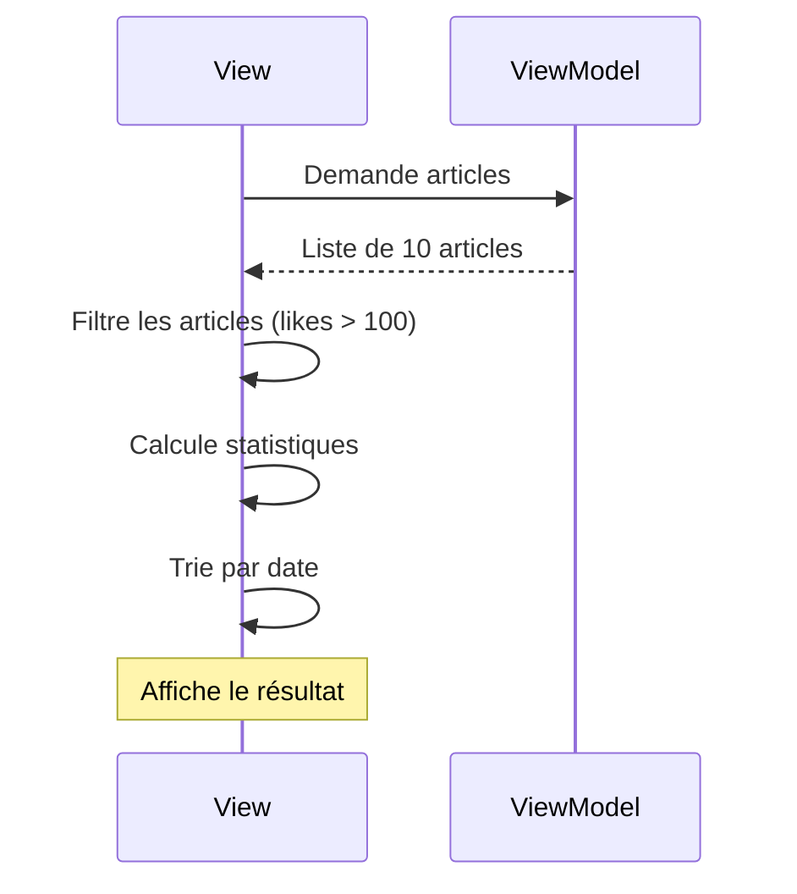
```mermaid
sequenceDiagram
    participant View
    participant ViewModel
    
    View->>ViewModel: Demande articles
    ViewModel-->>View: Liste de 10 articles
    View->>View: Filtre les articles (likes > 100)
    View->>View: Calcule statistiques
    View->>View: Trie par date
    Note over View: Affiche le résultat
```

**Est-ce du MVVM ?**

<details>
<summary>Voir la réponse</summary>

**NON, ce n'est PAS du MVVM !**

**Erreurs multiples :**
- La View fait du filtrage
- La View calcule des statistiques
- La View fait du tri

**Problème :**
- Toute la logique est dans la View
- Impossible de tester la logique
- Code non réutilisable

**Solution :**
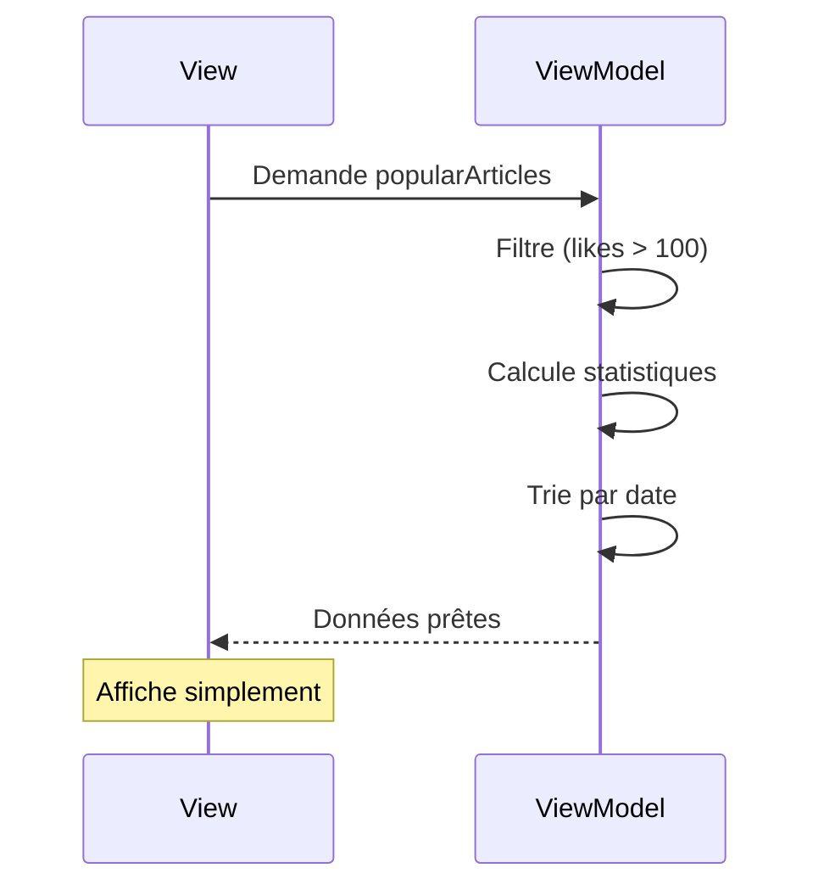
```mermaid
sequenceDiagram
    participant View
    participant ViewModel
    
    View->>ViewModel: Demande popularArticles
    ViewModel->>ViewModel: Filtre (likes > 100)
    ViewModel->>ViewModel: Calcule statistiques
    ViewModel->>ViewModel: Trie par date
    ViewModel-->>View: Données prêtes
    Note over View: Affiche simplement
```

</details>

---

## Question 10 : ViewModel avec BuildContext

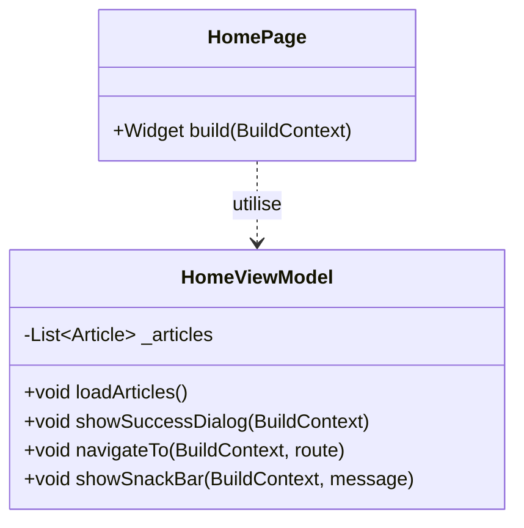
```mermaid
classDiagram
    class HomeViewModel {
        -List~Article~ _articles
        +void loadArticles()
        +void showSuccessDialog(BuildContext)
        +void navigateTo(BuildContext, route)
        +void showSnackBar(BuildContext, message)
    }
    
    class HomePage {
        +Widget build(BuildContext)
    }
    
    HomePage ..> HomeViewModel : utilise
```

**Est-ce du MVVM ?**

<details>
<summary>Voir la réponse</summary>

**NON, ce n'est PAS du MVVM !**

**Erreur :** Le ViewModel a des méthodes qui prennent `BuildContext` en paramètre

**Problème :**
- Le ViewModel ne doit PAS connaître Flutter
- Le ViewModel ne doit PAS gérer la navigation/dialogs directement
- Impossible de tester sans Flutter

**Solution :**
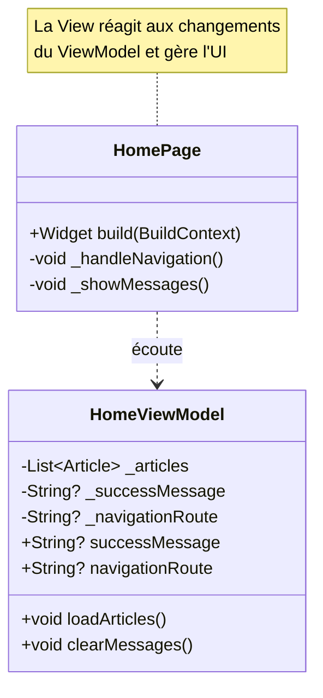
```mermaid
classDiagram
    class HomeViewModel {
        -List~Article~ _articles
        -String? _successMessage
        -String? _navigationRoute
        +String? successMessage
        +String? navigationRoute
        +void loadArticles()
        +void clearMessages()
    }
    
    class HomePage {
        +Widget build(BuildContext)
        -void _handleNavigation()
        -void _showMessages()
    }
    
    HomePage ..> HomeViewModel : écoute
    
    note for HomePage "La View réagit aux changements<br/>du ViewModel et gère l'UI"
```

</details>

---

## Question 11 : Tout dans un fichier

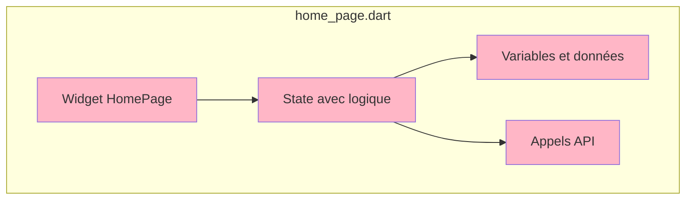
```mermaid
graph TB
    subgraph "home_page.dart"
        View[Widget HomePage]
        State[State avec logique]
        Data[Variables et données]
        API[Appels API]
    end
    
    View --> State
    State --> Data
    State --> API
    
    style View fill:#FFB6C6
    style State fill:#FFB6C6
    style Data fill:#FFB6C6
    style API fill:#FFB6C6
```

**Est-ce du MVVM ?**

<details>
<summary>Voir la réponse</summary>

**NON, ce n'est PAS du MVVM !**

**Erreur :** Tout est mélangé dans un seul fichier

**Problème :**
- Pas de séparation des responsabilités
- Code "spaghetti"
- Impossible de tester
- Impossible de réutiliser

**Solution :**
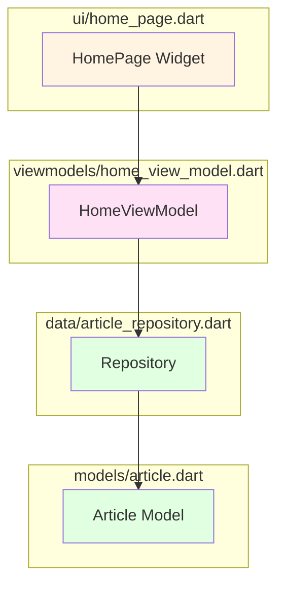
```mermaid
graph TB
    subgraph "ui/home_page.dart"
        View[HomePage Widget]
    end
    
    subgraph "viewmodels/home_view_model.dart"
        VM[HomeViewModel]
    end
    
    subgraph "data/article_repository.dart"
        Repo[Repository]
    end
    
    subgraph "models/article.dart"
        Model[Article Model]
    end
    
    View --> VM
    VM --> Repo
    Repo --> Model
    
    style View fill:#fff4e1
    style VM fill:#ffe1f5
    style Repo fill:#e1ffe1
    style Model fill:#e1ffe1
```

</details>

---

## Question 12 : Communication complexe

```mermaid
flowchart TD
    View[View]
    VM[ViewModel]
    Repo[Repository]
    Model[Model]
    
    View -->|1. Appelle| VM
    VM -->|2. Demande| Repo
    Repo -->|3. Parse| Model
    Model -->|4. Retourne| Repo
    Repo -->|5. Retourne| VM
    VM -->|6. Notifie| View
    View -->|7. Lit| VM
    VM -->|8. Met à jour| Model
    Model -->|9. Notifie| View
    
    style View fill:#fff4e1
    style VM fill:#ffe1f5
    style Repo fill:#e1ffe1
    style Model fill:#e1ffe1
```

**Est-ce du MVVM ?**

<details>
<summary>Voir la réponse</summary>

**NON, ce n'est PAS du MVVM !**

**Erreurs :**
- Étape 8 : Le ViewModel ne doit pas "mettre à jour" le Model
- Étape 9 : Le Model ne doit PAS notifier la View directement

**Problème :**
- Le Model ne doit pas être observable
- Communication incorrecte entre couches
- Le Model est juste des données

**Solution :**
```mermaid
flowchart TD
    View[View]
    VM[ViewModel]
    Repo[Repository]
    Model[Model classe de données]
    
    View -->|1. Appelle| VM
    VM -->|2. Demande| Repo
    Repo -->|3. Utilise| Model
    Model -->|4. Retourne données| Repo
    Repo -->|5. Retourne List Model| VM
    VM -->|6. Stocke et notifie| View
    View -->|7. Lit getters| VM
    
    Note[Le Model ne notifie jamais]
```

</details>

---

## Question 13 : Multiple sources de données

```mermaid
graph TB
    View[HomePage]
    VM[HomeViewModel]
    API[API REST]
    DB[(Base de données)]
    
    View --> VM
    VM --> API
    VM --> DB
    
    style View fill:#fff4e1
    style VM fill:#ffe1f5
    style API fill:#e1ffe1
    style DB fill:#e1ffe1
```

**Est-ce du MVVM ?**

<details>
<summary>Voir la réponse</summary>

**NON, ce n'est PAS du MVVM !**

**Erreur :** Le ViewModel appelle directement l'API et la DB

**Problème :**
- Le ViewModel ne doit pas gérer les sources de données
- Manque la couche Repository
- Responsabilités mélangées

**Solution :**
```mermaid
graph TB
    View[HomePage]
    VM[HomeViewModel]
    Repo[ArticleRepository]
    API[API REST]
    DB[(Base de données)]
    
    View --> VM
    VM --> Repo
    Repo --> API
    Repo --> DB
    
    Note[Le Repository gère<br/>les sources de données]
    
    style View fill:#fff4e1
    style VM fill:#ffe1f5
    style Repo fill:#e1ffe1
    style API fill:#e1ffe1
    style DB fill:#e1ffe1
```

</details>

---

## Question 14 : Injection de dépendances

```mermaid
classDiagram
    class HomeViewModel {
        +loadArticles()
    }
    
    class ArticleRepository {
        +getArticles()
    }
    
    HomeViewModel --> ArticleRepository : crée en interne
    
    note for HomeViewModel "final repo = ArticleRepository()"
```

**Est-ce du MVVM ?**

<details>
<summary>Voir la réponse</summary>

**Techniquement MVVM, mais MAUVAISE PRATIQUE !**

**Problème :** Le ViewModel crée le Repository en interne

**Pourquoi c'est problématique :**
- Difficile à tester (impossible de mocker)
- Couplage fort
- Pas d'injection de dépendances

**Solution (meilleure pratique) :**
```mermaid
classDiagram
    class HomeViewModel {
        -ArticleRepository repository
        +HomeViewModel(repository)
        +loadArticles()
    }
    
    class ArticleRepository {
        +getArticles()
    }
    
    HomeViewModel --> ArticleRepository : injecté
    
    note for HomeViewModel "Constructeur avec injection"
```

```dart
// main.dart
ChangeNotifierProvider(
  create: (context) => HomeViewModel(
    repository: context.read<ArticleRepository>(),
  ),
)
```

</details>

---

## Question 15 : Architecture finale

```mermaid
graph TB
    subgraph "PRÉSENTATION"
        V1[HomePage]
        V2[DetailsPage]
    end
    
    subgraph "LOGIQUE"
        VM1[HomeViewModel<br/>ChangeNotifier]
        VM2[DetailsViewModel<br/>ChangeNotifier]
    end
    
    subgraph "DONNÉES"
        R[ArticleRepository<br/>Future methods]
        M[Article<br/>Classe pure]
    end
    
    V1 -->|context.watch| VM1
    V2 -->|context.watch| VM2
    VM1 -->|getArticles| R
    VM2 -->|getById| R
    R -->|retourne| M
    VM1 -.->|notifyListeners| V1
    VM2 -.->|notifyListeners| V2
    
    style V1 fill:#fff4e1
    style V2 fill:#fff4e1
    style VM1 fill:#ffe1f5
    style VM2 fill:#ffe1f5
    style R fill:#e1ffe1
    style M fill:#e1ffe1
```

**Est-ce du MVVM ?**

<details>
<summary>Voir la réponse</summary>

**OUI, c'est du MVVM parfait !**

**Raison :**
- Views : écoute et affichage seulement
- ViewModels : hérite de ChangeNotifier, contient la logique
- Repository : méthodes Future, pas d'état observable
- Model : classe pure de données
- Flux unidirectionnel clair
- Communication par notifyListeners/context.watch
- Séparation parfaite des responsabilités

**C'est le modèle à suivre !**

</details>

---

## Récapitulatif des erreurs fréquentes

### Erreurs dans la View
```mermaid
mindmap
  root((Erreurs<br/>View))
    Appelle Repository
    Fait des calculs
    Contient logique métier
    Modifie état ViewModel
    Crée des instances
```

### Erreurs dans le ViewModel
```mermaid
mindmap
  root((Erreurs<br/>ViewModel))
    Retourne Widget
    Utilise BuildContext
    Connaît la View
    Importe Flutter material
    Crée Repository interne
```

### Erreurs dans le Model
```mermaid
mindmap
  root((Erreurs<br/>Model))
    Hérite ChangeNotifier
    Appelle notifyListeners
    Contient logique métier
    Gère état observable
    Fait appels API
```

---

## Checklist visuelle finale

```mermaid
flowchart TD
    Start{Code à analyser}
    
    Start --> Q1{View fait<br/>des calculs ?}
    Q1 -->|Oui| NotMVVM1[PAS MVVM]
    Q1 -->|Non| Q2{ViewModel<br/>retourne Widget ?}
    
    Q2 -->|Oui| NotMVVM2[PAS MVVM]
    Q2 -->|Non| Q3{Model hérite<br/>ChangeNotifier ?}
    
    Q3 -->|Oui| NotMVVM3[PAS MVVM]
    Q3 -->|Non| Q4{Repository<br/>gère état ?}
    
    Q4 -->|Oui| NotMVVM4[PAS MVVM]
    Q4 -->|Non| Q5{View appelle<br/>Repository ?}
    
    Q5 -->|Oui| NotMVVM5[PAS MVVM]
    Q5 -->|Non| Q6{ViewModel utilise<br/>BuildContext ?}
    
    Q6 -->|Oui| NotMVVM6[PAS MVVM]
    Q6 -->|Non| IsMVVM[C'est du MVVM !]
    
    style NotMVVM1 fill:#FFB6C6
    style NotMVVM2 fill:#FFB6C6
    style NotMVVM3 fill:#FFB6C6
    style NotMVVM4 fill:#FFB6C6
    style NotMVVM5 fill:#FFB6C6
    style NotMVVM6 fill:#FFB6C6
    style IsMVVM fill:#90EE90
```

---

## Score final

Combien de questions avez-vous réussies ?

| Score | Niveau |
|-------|--------|
| 13-15 | Expert MVVM |
| 10-12 | Avancé |
| 7-9 | Intermédiaire |
| 4-6 | Débutant |
| 0-3 | À revoir |

---

## Pour aller plus loin

- [01-ARCHITECTURE.md](01-ARCHITECTURE.md) - Architecture détaillée
- [03-MVVM-EXPLIQUE.md](03-MVVM-EXPLIQUE.md) - Diagrammes explicatifs
- [07-QUIZ-MVVM.md](07-QUIZ-MVVM.md) - Quiz textuel
- [08-MVVM-OU-PAS.md](08-MVVM-OU-PAS.md) - Exemples de code

---

**Maintenant vous savez reconnaître du MVVM visuellement !**

